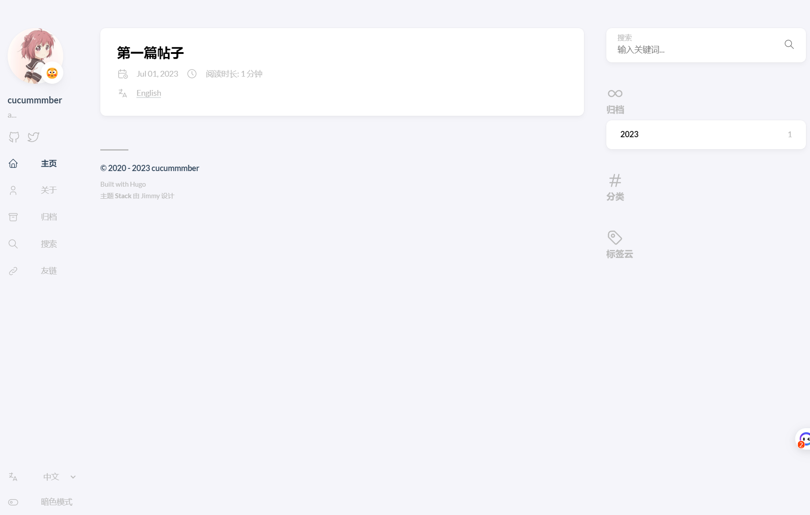
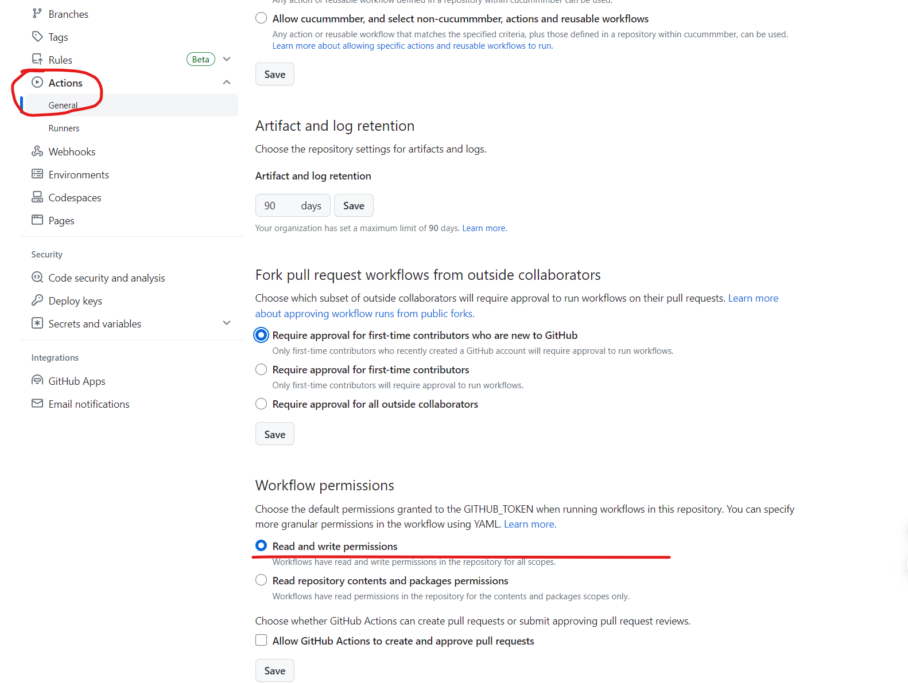
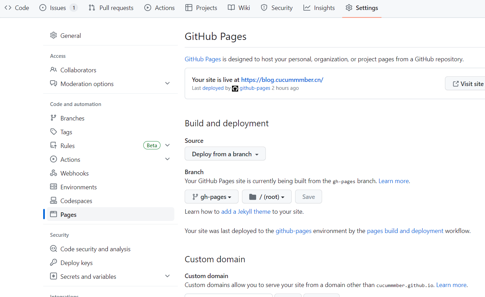
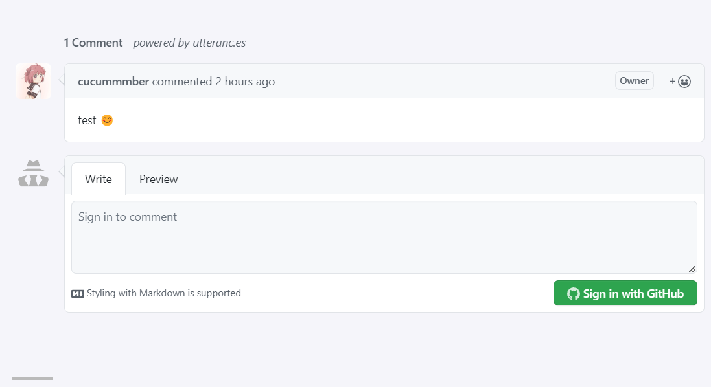
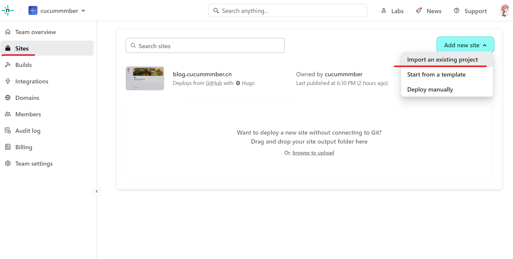
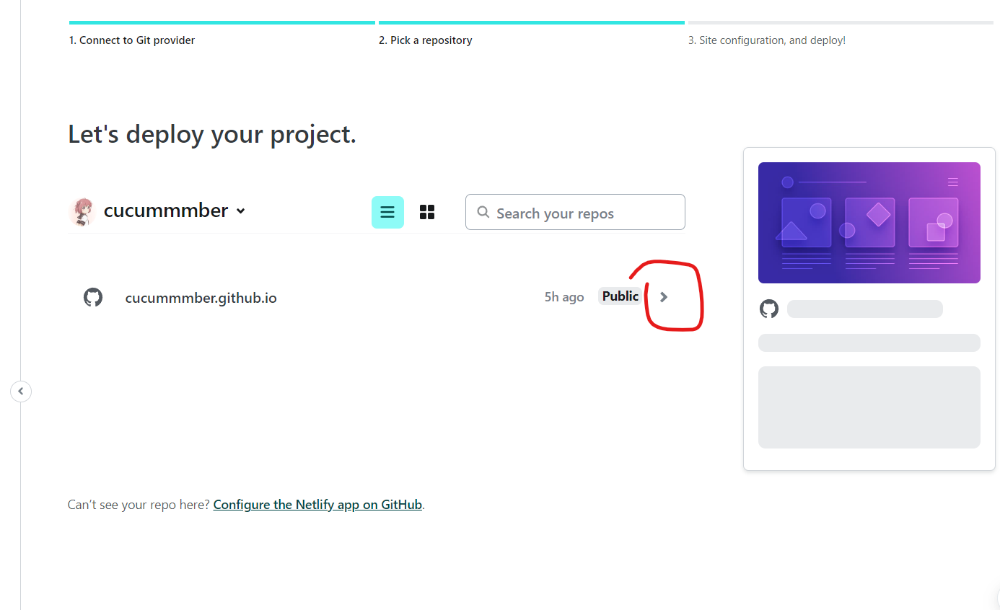
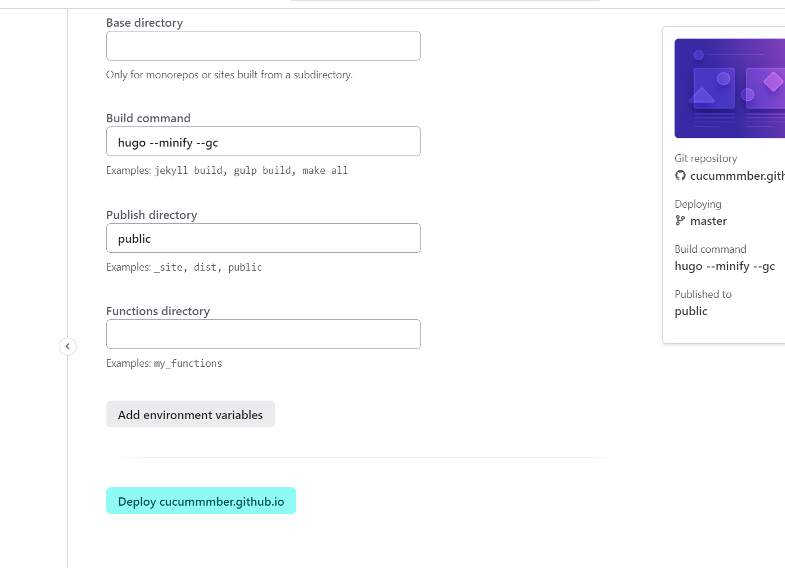

+++
author = "阿昌" 
title = "Hugo 教程，自动部署，stack 主题配置"
date = 2023-07-01T21:02:13+08:00
draft = false
description = "下载 hugo ，安装配置 stack 主题，自动部署到 GitHub pages ，Netlify"
keywords = ["Hugo ","自动部署","hugo-theme-stack","Netlify","GitHub pages"]
tags = ["Hugo ","stack","Netlify"]
toc = true

+++

### 下载 hugo

从 [Github Releases](https://github.com/gohugoio/hugo/releases) 页面下载对应系统的 extended 版本二进制文件。

> or 使用 <code>scoop</code>下载无需配置环境变量。

```shell
scoop install hugo-extended
```

解压从 Github 下载的压缩包，将hugo.exe放置到任意目录，并将此目录加入到环境变量。

#### 设置环境变量

打开 Poweshell 输入命令，路径改为你的 hugo.exe 所在目录。

```shell
Set-ItemProperty -Path HKCU:\Environment -Name Path -Value ($env:Path + ";D:\hugo")
```

关闭 Poweshell 重新打开 *（ps：使用 Windows Terminal 需要将其全部关闭，只关闭 Poweshell 标签无用）* 。

```shell
$ $env:PATH        //查看环境变量是否添加成功
$ hugo version     //查看 hugo 版本
hugo v0.113.0-085c1b3d614e23d218ebf9daad909deaa2390c9a+extended windows/amd64 BuildDate=2023-06-05T15:04:51Z VendorInfo=gohugoio
```

#### 生成项目

使用 <code>hugo new site myblog</code> 在当前目录生成 blog 项目 myblog，并切换到 myblog 目录。

```shell
$ hugo new site myblog
Congratulations! Your new Hugo site is created in D:\Code\myblog.
$ cd myblog
```

### 下载 [hugo-theme-stack](https://github.com/CaiJimmy/hugo-theme-stack) 主题

<mark>stack 主题文档：[https://stack.jimmycai.com/](https://stack.jimmycai.com/) </mark>

使用 git 命令将主题下载至 themes 文件夹。

```shell
git clone https://github.com/CaiJimmy/hugo-theme-stack.git themes/hugo-theme-stack
```
或添加为 git 项目的子模块（如果你已经将 myblog 目录添加到版本控制）。
```shell
git submodule add https://github.com/CaiJimmy/hugo-theme-stack.git themes/hugo-theme-stack
```

#### 配置主题

将 stack主题目录下 <code>exampleSite</code> 文件夹中的内容，全部复制到blog 项目根目录。

打开 <code>config.yaml</code> 配置文件

#### 修改默认语言

```yaml
# 将 title 全部改为自己的
title: Example Site
title: 演示站点

# 根据需要，将对阿拉伯语的支持注释掉
# ar:
#     languageName: عربي
#     languagedirection: rtl
#     title: موقع تجريبي
#     description: وصف تجريبي
#     weight: 3

# 更改网站的默认语言为中文简体
DefaultContentLanguage: zh-cn
hasCJKLanguage: true
```

将 <code>content/_index.md</code> 改为 <code> _index.en.md</code> 将<code>content/page</code> 目录下所有 <code>index.md</code> 改为  <code>index.en.md</code> 。

之后再创建 index.md 默认识别为中文文章，index.en.md 为英文文章，在切换网站语言时会根据语言分别显示不同的文章。（ps：不修改默认语言无需此操作）


此时网站切换为中文时，有一部分仍显示为英文。

将 <code>content/page</code> 下四个目录中的 <code>index.en.md</code> 文件全部复制一份改名为 <code>index.zh-cn.md</code> 并打开，修改  <code> title: xxx</code>  ，xxx部分改为中文。

#### 部分配置解释

```yaml
# params 部分
params:
	favicon: /favicon.ico	# 网站的图标，放置在网站根目录 static 文件夹
	
	footer:
		since: 2020	# 页脚的网页创建年份
        customText:		# 页脚自定义文本，支持html

    sidebar:			# 侧边栏
        emoji: 😳		# 头像上显示的表情
        subtitle: a...			
        avatar:
            enabled: true	# 是否启用头像
            local: true			
            src: img/Akari.png	# 图像位置，项目根目录 assets 文件夹下

	comments:			# 评论系统
        enabled: true	# 是否启用
        provider: utterances	# 使用那个评论系统，推荐 utterances
    widgets:		# 网站右侧显示的内容，详情参见主题文档

# menu部分
menu:
	social:		 # 头像下方的链接

```

运行一下看看效果

```shell
hugo server
```

#### 设置文章模板

打开 <code>.\archetypes\default.md</code> 修改配置

```yaml
---
author: 
title: "{{ replace .Name "-" " " | title }}"
date: {{ .Date }}
draft: true
description: 
keywords: 
tags: 
categories: 
image: 
toc: true
license: 
---
```


### 发布文章

将 <code>content\post</code> 文件夹下所有内容删除掉，创建一篇文章 my-first-post 。

```
hugo new post/my-first-post/index.md
```

打开 index.md 加入内容，修改title为中文。同级目录下创建 index.en.md ，将index.md 中内容全部复制过去，并改成英文。

运行hugo server 查看效果

```shell
hugo server --buildDrafts
```



重新打开文件，将 <code>draft: true</code> 改为 <code>draft: false</code> ，保存并再次启动服务。

```
hugo server
```

#### 部分文章配置翻译

文章配置写在文章最上方，使用 “ --- ” 或者 “ +++ ” 包裹。例如：

```
---
title: 123
---
+++
title = "123"
+++
```

“ --- ” 内为 <code>yaml</code> 语法，“ +++ ” 内为 <code>toml</code> 语法，要遵循相应的语法格式。

```yaml
author: Type:string		# 作者
tags: Type:[]string		# 标签
categories: Type:[]string	# 分类
draft: Type:bool    # 是否草稿，草稿需运行服务时加入 --buildDrafts 指令才会显示
description: Type:string	# 显示在文章卡片上的描述
image: Type:string		# 显示在文章卡片和文章最上方的图片
comments: Type:bool		#是否显示评论
license: Type:string|bool	# 版权许可声明，false 时不显示
math: Type:bool			# 是否开启数学公式支持
toc: Type:bool			# 是否显示文章的目录
keywords: Type:[]string		# 页面的关键字。对于搜索引擎优化有用。
readingTime: Type:bool		# 显示/隐藏页面的阅读所需时间
```

### 部署到 Github

#### 编写自动化部署工作流

修改 config.yaml ,中的 baseurl ，为你的链接。例如 https://username.github.io

```yaml
baseurl: https://blog.cucummmber.cn/
```

利用 [Github Actions](https://github.com/features/actions) 自动部署到 [Github pages](https://pages.github.com/) ，GitHub Actions 是一个(CI/CD) 平台， 它可以让你自动化你的构建、测试和部署流程。 

想要使用需要在repo根目录创建 <code> .github\workflows\xxx.yaml</code> 。

以下是一个工作流示例：当收到 push 事件时，会自动拉取代码，缓存 resources 文件夹，安装Hugo，构建 blog ，然后自动发布到 Github pages 。


```yaml
name: github pages # 工作流的名称

# 触发工作流的事件 Event 下面设置的是当 push 到 master 分支后触发
# 其他的事件还有：pull_request/page_build/release
# 可参考：https://help.github.com/en/actions/reference/events-that-trigger-workflows
on:	
  push:
    branches:
    	- master

# jobs 即工作流中的执行任务
jobs:
  build-deploy: # job-id
    runs-on: ubuntu-20.04 # 容器环境
    # needs: other-job 如果有依赖其他的 job 可以如此配置
    
    # 任务步骤集合
    steps:
    - name: Checkout	# 步骤名称
      uses: actions/checkout@v3	# 引用可重用的 actions，比如这个就是 GitHub 官方的用于拉取代码的actions `@` 后面可以跟指定的分支或者 release 的版本或者特定的commit
      with:	# 当前 actions 的一些配置
        submodules: true # 如果项目有依赖 Git 子项目时可以设为 true，拉取的时候会一并拉取下来
        
    - name: Cache Hugo resources	#缓存 resources 文件夹
      uses: actions/cache@v2
      env:
        cache-name: cache-hugo-resources
      with:
        path: resources
        key: ${{ env.cache-name }}
        
    - name: Setup Hugo
      uses: peaceiris/actions-hugo@v2	# 一个开源的 actions 用于安装 Hugo
      with:
        hugo-version: '0.112.2' #hugo 版本
        extended: true	# 是否启用 hugo extend

    - name: Build
      run: hugo --minify --gc # 一个 step 也可以直接用 run 执行命令。如果有多个命令可以如下使用
      #run: |
    		#npm ci
    		#npm run build

    - name: Deploy
      uses: peaceiris/actions-gh-pages@v3 # 开源 actions 用于部署
      with:
        github_token: ${{ secrets.GITHUB_TOKEN}} # GitHub 读写仓库的权限token，自动生成无需关心
        publish_dir: ./public	# 发布 ./public 的内容到默认的 gh-pages 分支
        cname: blog.cucummmber.cn	# 自定义域名，不需要可删掉
```

#### 创建 Github 仓库

打开 https://github.com/  创建一个仓库，命名为 ” username.github.io “ 例如：cucummmber.github.io


GITHUB_TOKEN 为 Actions  工作时自动创建的一个变量，如果希望 Workflow 能够正常的推送代码，请确保你的 Workflow permissions 有写入权限。

在此设置 Workflow 权限，你的仓库 -> Settings -> Actions -> General , 滑动到页面最下方 ，将 Workflow permissions 设置为 Read and write permission 。




将项目推送至 github 仓库。

```shell
git init	# 初始化为 git 仓库
git submodule add https://github.com/CaiJimmy/hugo-theme-stack.git themes/hugo-theme-stack	# 将 stack 主题项目添加为 blog 项目的子模块

git add .	
git commit -m "message"
git remote add origin <远程存储库URL>	# 添加一个远程仓库
git branch gh-pages 	#创建一个分支
git push -u origin master
git push origin gh-pages	#将分支推送到远程仓库
```


网页打开你的仓库，选择 Settings -> Pages 将 Build and deployment 项设置为 Deploy from branch ，并选择 gh-pages 分支，不然第一次部署无法成功。




再次将主分支推送到远程仓库。

```shell
git push -u origin master
```

如无意外应该自动部署成功。


#### 添加 utterances 评论

参考官方文档：[**utterances**](https://utteranc.es/)

- 无跟踪，无广告，永远免费 

- 所有数据都保存在 github 的 issues 

- 轻量，不需要下载字体等 

    

1.安装 utterances ，访问链接直接安装即可。GitHub App 链接：[https://github.com/apps/utterances](https://github.com/apps/utterances)

仓库选择刚刚创建的 ” username.github.io “ 


2.配置 comments ，打开 config.yaml 文件，导航到 comments  选项

```yaml
    comments:
        enabled: true	# 开启评论功能
        provider: utterances	# 选择 utterances 评论插件
        
        utterances:
            repo: 用户名/仓库名	# 存储评论的仓库
            issueTerm: pathname
            label: comment
```

3.测试

```
hugo server
```



4.推送

```shell
git push
```

### 部署到 [Netlify](https://app.netlify.com/)

Github 因为众所周知的原因，在国内访问很慢，甚至无法访问，我们可以在 Netlify 再部署一份，用作负载均衡，

使用 Netlify 部署非常简单，只需点点鼠标。

#### 注册 Netlify  账号

地址：https://app.netlify.com/   直接使用 Github 登录即可。


#### 从 GIthub 导入项目

1.选择 Sites - > Add new site ->  import an existing project ，从现存项目导入



2.选择 Deploy with GitHub ，在弹出页面选择你的 blog 所在项目


3.点击项目进入配置页面




4.设置 Build command 为 <code>hugo --minify --gc</code> ，设置 Publish directory <code>public</code> ，点击 Deploy



之后 github 接收到 push 这边会同时自动部署。部署成功后可根据需要自定义为自己的域名，并在域名提供商设置里，将自己的域名同时解析到 Netlify 和 Github pages。